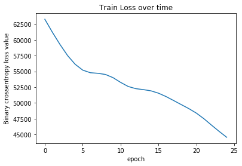
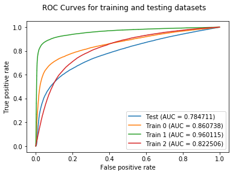
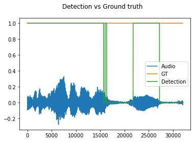

# pytorch-voice-activity-detection-rnn
A simple prototype of an RNN for Voice Activity Detection using Pytorch.
All computation was done on Google Colab.

Data was trained using data provided by [jtkim-kaist](https://github.com/jtkim-kaist/VAD).
Data consists of 4 conversations under different noise condition scenarios. I've used 3 for training 
and 1 for testing, achieving an AUC of 0.78, which is not very good but not so shameful either.

click the **NeuralVoiceActivityDetection.ipynb** file to view the modules and results. 
There's also a button there to reproduce and modify this experiment, if you'd like.

